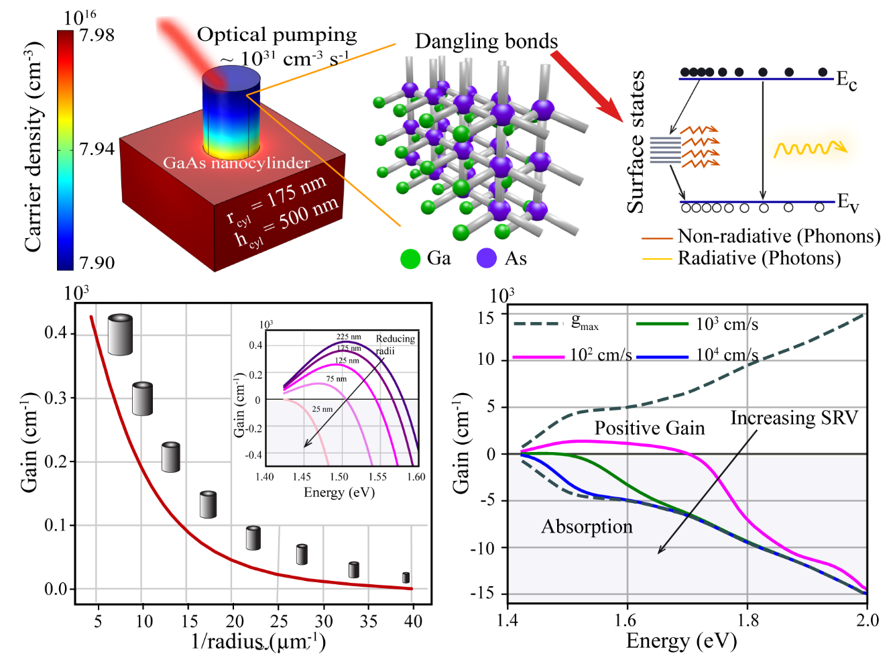

Optical gain in semiconductor nanostructures plays a crucial role in designing active, PT-symmetric nanophotonic devices. However, when the III-V
semiconductor structures are scaled down to the nanoscale dimensions, the non-radiative processes, primarily surface recombination lower the overall optical gain due to an increased surface-to-volume
ratio. For the practical realization of PT nanophotonic devices, it is essential to investigate the impact of surface recombination on optical gain in III-V semiconductor nanostructures. First, we
discuss our numerical investigation of carrier dynamics in GaAs nanocylinder on optical pumping, which enabled us to estimate the qualitative and quantitative impact of surface recombination on
the optical gain. Through this study we provide a straightforward approach for enhancing the luminescence quantum yield of III-V semiconductor nanostructures by using p-doped active material.

#### Impact of the carrier surface recombination on the optical gain
Our numerical investigation of carrier dynamics in GaAs nanocylinder on optical pumping lead us to estimate the qualitative and quantitative impact of surface recombination on the optical gain. The optically induced carrier density is lower in nanocylinder due to the dangling bonds at the surface that give rise to recombination of electron hole pairs. With reduced dimensions of the nanostructures, surface area-to-volume (A/V) ratio increases, and therefore the lasing threshold also increases due to higher non-radiative surface recombination process. The optical gain and bandwidth both reduce with increasing surface recombination velocity (SRV). The study gives an insight that p-doping of active material and strain incorporation as a viable approach for enhancing luminescence quantum yield of III-V semiconductor nanostructures. This can complement the surface passivation techniques widely adopted in the III-V research community.

<b>Figure 1:</b> Impact of Surface Recombination and nanocylinder size on optical gain. Further details can be found in  reference [1]

#### References

1. <b>Jinal Kiran Tapar</b>, Saurabh Kishen, Kumar Prashant, Kaushik Nayak and Naresh Kumar Emani. <a href="https://doi.org/10.1063/1.5132613">Enhancement of the optical gain in GaAs nanocylinders for nanophotonic applications.</a> <em> Journal of Applied Physics</em>, <b>127</b>, 153102 (2020).  [&nbsp; <a href="https://doi.org/10.1063/1.5132613">doi</a>&nbsp;|&nbsp; <a href="../../e-pubs/J13_JAP_Gain_in_GaAs_Nanocylinders_2020_Jinal.pdf">pdf</a>&nbsp;]
