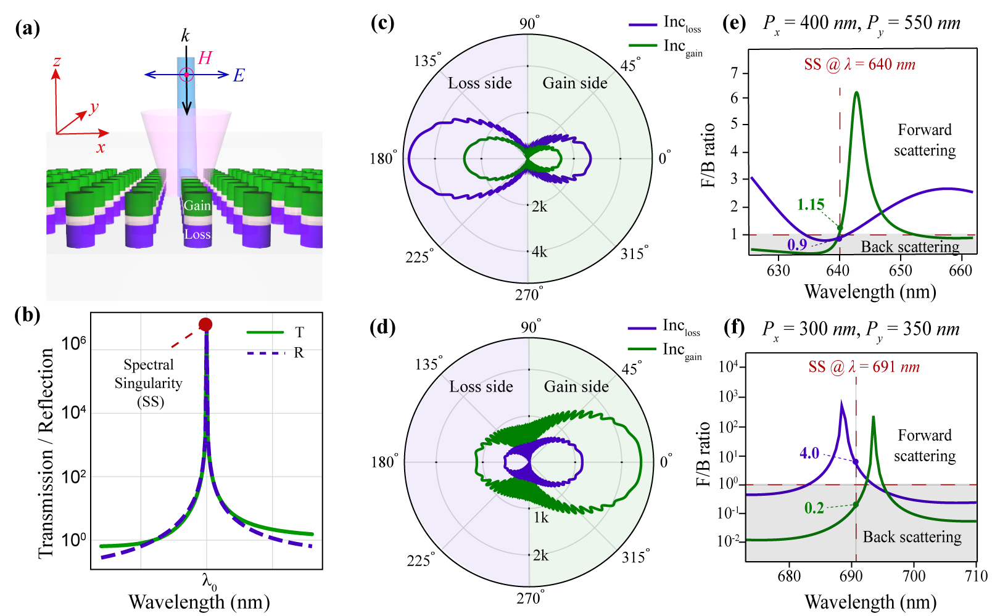

Recent years have seen tremendous progress in implementing metamaterials and metasurfaces to control light-matter dynamics. Metasurfaces are two-dimensional (2D) periodic
arrangements of resonators used to control the intrinsic properties of light (<em>viz.</em> phase, intensity, wavevector, and polarization). The landscape of metamaterials and metasurfaces
is dominated by efforts to synthesize the effective permittivity and permeability along the real axis of parameter space. The  concept of (parity-time) PT symmetry has opened a fundamentally new chapter in photonics and expanded the toolbox of photonics by broadening the design parameter space. In the context of photonics, PT symmetry implies an
index profile of the form ∼ n(x) = n∗(x). This imposes a constraint of securing balanced gain and loss distribution in the system. The interplay of gain-loss contrast and coupling in PT-symmetric systems has manifested as a number of intriguing breakthrough effects like single-mode lasing, unidirectional invisibility, (coherent perfect absorber) CPA-laser, <em>etc.</em>
(See recent review articles [1,2] on parity-time symmetry in optics)

#### PT-symmetric semiconductor nanoantenna metasurface
For realizing active nanophotonic devices, it is paramount to design a dielectric nanocavity that can confine light both in space and time, <em>i.e.</em>, a high Q-cavity with a small modal volume. 
In this work, we investigated vertically stacked GaInP PT-symmetric nanodisk resonators arranged in two-dimensional periodic lattice using full-wave numerical simulations and scattering matrix theory. 
The proposed dielectric metasurface supports scattering anomalies called lasing spectral singularities (SS). At SS, the scattering coefficients (transmission and reflection) diverge to large values, corresponding to the lasing threshold. 
This lasing spectral singularities can occur only in the presence of gain and being poles of the scattering matrix at real frequencies, imply zero-width resonances. We showed that the far-field scattering
response at the spectral singularity is highly asymmetric for incidence from the gain and loss sides.
The anisotropic directional response of SS in the proposed PT -symmetric nanoantenna array can be tuned to show predominant scattering toward either side of the structure by changing the lattice periodicities. 
Our analysis suggests that a proper combination of geometry, gain, and subwavelength resonances provides flexibility for designing tunable and directional nanophotonic light sources employing non-Hermitian physics.

<b>Figure 2:</b> PT symmetric nanostructures can be designed to exhibit extremely narrow-width resonances known as Spectral Singularities.  Further details can be found in reference [3].

#### References

1. Özdemir, Ş., Rotter, S., Nori, F., Yang, L., <a href="https://www.nature.com/articles/s41563-019-0304-9"> Parity–time symmetry and exceptional points in photonics. </a> <em>Nature Materials </em>, <b>18</b> (8), 783-798 (2019).
2. Alex Krasnok, Denis Baranov, Huanan Li, Mohammad-Ali Miri, Francesco Monticone, and Andrea Alú, <a href="https://www.osapublishing.org/aop/abstract.cfm?uri=aop-11-4-892"> Anomalies in light scattering. </a> Advances in Optics and Photonics. <b>11</b>, 892-951 (2019) 
3. <b>Jinal Kiran Tapar</b>, Saurabh Kishen, Naresh Kumar Emani. <a href="https://www.osapublishing.org/ol/abstract.cfm?uri=ol-45-18-5185">Spectral singularities and asymmetric light scattering in PT-symmetric 2D nanoantenna arrays.</a> <em> Optics Letters</em>, <b>45</b>, 18, pp. 5185-5188 (2020).  
